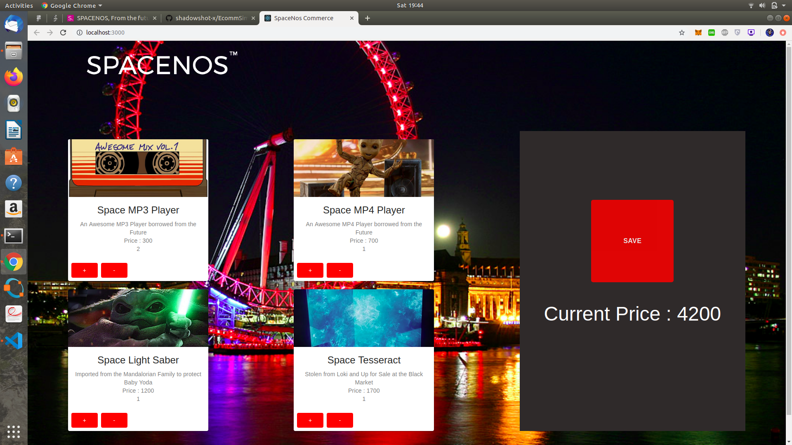

## SPACE ECOMMERCE

The following project uses React,Redux and Firebase for executing an ecommerce site with user Authentication. 

The Site Inlcudes 4 Products, that can be added to the Cart which shows dynamic price. The Prefernces can be saved and shopping can be continued the next time.

Redux has been used for State management and flow of data.Material-Ui has been used as Framework.

## Screenshots

